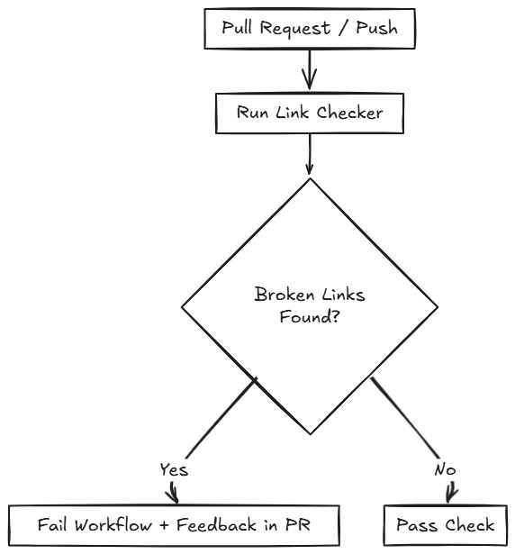
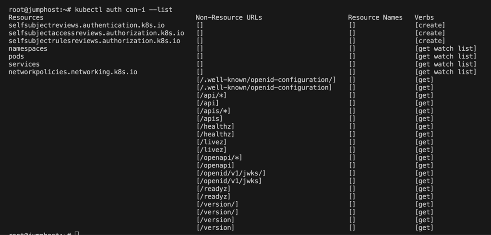

Trying out OpenAI model to write alt text for couple of images.

Here is a random image of flow for using GitHub action to find broken links:

Here is a random screenshot running `kubectl auth can-i` command

